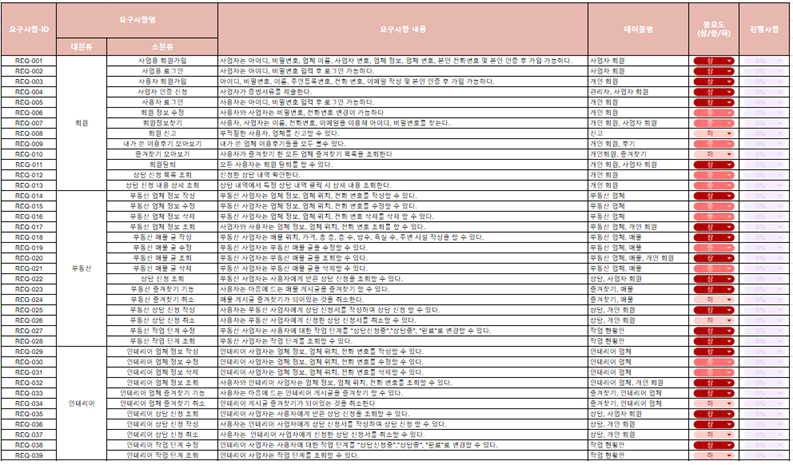
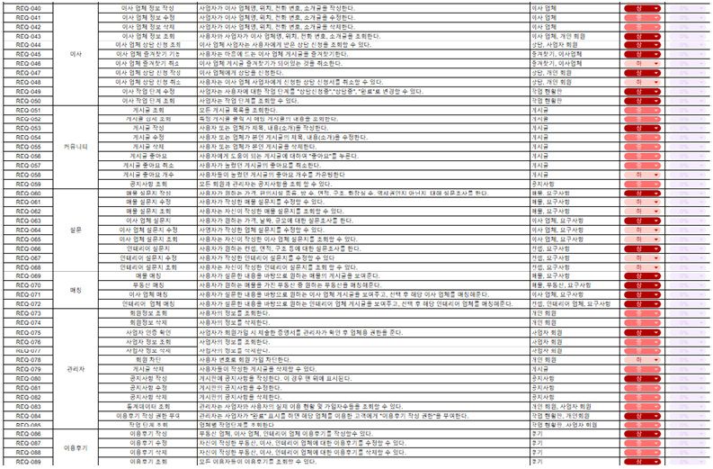
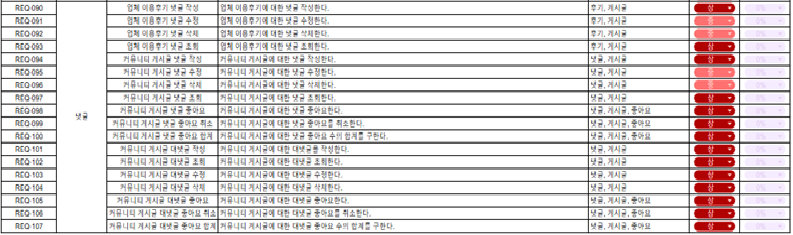

# be15-1st-DetectiveConan-DoItAllHolmes

---

## 목차
1. [프로젝트 기획서](#Project Proposal)
2. [프로젝트 세부 사항](#Project Detail)
3. [기술 스택](#Tech Stacks)
4. [WBS](#WBS)
5. [모델링](#Modeling)
6. [테스트케이스 및 쿼리](#TestCase and Query)
7. [동료평가](#Feedback)

---
## Project Proposal
### Do It All, Holmes!
> ## 목표
> ---
>> ⭐ 집 구하는 것부터 시작해서 이사, 인테리어, 매물 구하는 것까지 ONE-STOP으로 제공

### Project Overview
>> **1. 사용자는 한 번의 설문조사만으로 부동산 매물 확인, 인테리어, 이사 업체 연결까지 원스톱(ONE-STOP)으로 제공받아, 여러 업체에 일일이 정보를 문의하는 번거로움을 줄일 수 있습니다.**

>> **2. 또한 정보의 비대칭성을 해소하기 위해 사용자들의 투명한 후기를 제공하여 보다 신뢰할 수 있는 결정을 내릴 수 있도록 돕습니다.** 

>> **3. 이 플랫폼은 사용자의 요구사항을 반영한 맞춤형 서비스를 제공하며, 바쁜 현대인들에게 편리함과 안정감을 선사하는 유용한 솔루션입니다.**
### Problem Definition
> 
> >> **🗨 매물 찾기부터 이사까지 최소 2주~8주 , 인테리어 1~2달, 업체 조사부터 연락, 날짜 선정 등 다 따로 따로 오랜 시간에 걸쳐 정해야 한다.**
> 
> >> **🗨 빠르게 변화하는 리모델링 트렌드, 맞춤형 인테리어 수요 증가, 소셜 미디어의 영향에 따라 계속해서 증가하고 있다.**
> 
> >> **🗨 4,50대의 경우 전원생활 희망하며, 단독주택 인테리어까지 희망 하는데 핸드폰을 오래보는 것이 힘들다.**
> 
> >> **🗨 여러 이사 업체와 인테리어 회사가 있어 한 번에 쉽게 업체 간의 특징을 비교 가능한 어플이 없어 이사와 인테리어에 불만족하는 사용자 증가하고 있다.**
> 
> >> **🗨 집, 이사, 인테리어에 대한 정보를 찾기 위해 여러 업체와 서비스에 가입 해야 하는 번거로움이 있다.**

[**관련 기사_1**](http://www.yongdal.pro/board/notice_view.html?n=45)  
[**관련 기사_2**](https://www.jutek.kr/user/selectBbsColumn.do?BBS_NUM=1374&COD03_CODE=c0318&MEN02_NUM=57&pageNum=1)  
[**관련 기사_3**](https://blog.opensurvey.co.kr/article/living-2020-2/)

### Project Necessity
> >> **💡한 번의 회원 가입으로 부동산 매물 검색부터 시작해, 맞춤형 인테리어 디자인과 이사 업체까지,  후기를 통해 신뢰할 수 있는 업체들과 사용자 한 명 한 명의 요구에 맞춰 최적의 선택을 가능하게 해준다.**
> 
> >> **💡이사 업체와 인테리어 업체에 대한 다른 사용자의 투명한 후기들로 인해 사용자들이 업체에 대해 불만족을 최대한 줄일 수 있다.**
> 
> >> **💡핸드폰을 오래 보는 것이 힘든 4,50대에게 빠르게 원하는 조건에 맞는 정보를 찾아준다.**
> 
> >> **💡집에 대한 고민이 있는 사람들에게 커뮤니티를 제공하여 정보를 공유할 수 있게 해준다.**

## Project Detail

### Target Customer
>
>- **나의 여건에 맞게 집을 구하고 싶고,**  
>- **내가 생각하는 조건에 맞는 인테리어를 할 수 있는 업체를 빠르게 찾고 싶고**
>- **믿을 수 있는 업체를 소개 받고 싶다!**
## **➡ 위의 과정을 ONE-STEP으로 소개 받고 싶은 사람**

### Main Function
> - **부동산 매물 검색**
> >> **💡지역, 가격, 면적 등 사용자의 조건에 맞는 다양한 매물을 검색하고 비교할 수 있습니다.**
> - **인테리어 디자인 서비스**
> >> **💡사용자는 각 인테리어 업체가 제공하는 다양한 디자인 포트폴리오를 확인하여, 자신이 원하는 스타일과 분위기를 갖춘 디자인을 쉽게 선택할 수 있습니다.**
> - **이사 업체 연결**
> >> **💡사용자는 포장이사와 반포장이사 등 다양한 이사 서비스 종류를 선택하여 자신에게 가장 적합한 옵션을 결정하고, 이사 일정을 예약할 수 있습니다.**
> - **커뮤니티**
> >> **💡커뮤니티를 통해 누구나 자신의 방의 인테리어나 가구를 소개하는 글을 작성해 서로 소통할 수 있습니다.**

### Product
> #### usecase
>> 

> #### Software Requirement Specification
>> 
>> 
>> 

## Tech Stacks
| Category | Tools/Technologies |  
|----------|-------------------|
| Database ||
| VCS      |

 회원

로그인

회원가입

회원 정보 수정

회원정보찾기

회원신고

내가 쓴 이용후기 모아보기

즐겨찾기 모아보기

회원탈퇴

상담 신청 목록 조회

상담 신청 내용 상세 조회

 부동산

부동산 업체 정보 작성

부동산 업체 정보 수정

부동산 업체 정보 삭제

부동산 업체 정보 조회

부동산 매물 글 작성

부동산 매물 글 수정

부동산 매물 글 조회

부동산 매물 글 삭제

부동산 상담 신청 조회

부동산 상담 신청 작성

부동산 상담 신청 취소

부동산 즐겨찾기 기능

부동산 즐겨찾기기 취소

부동산 작업 단계 수정

부동산 작업 단계 조회

 인테리어

인테리어 업체 정보 작성

인테리어 업체 정보 수정

인테리어 업체 정보 삭제

인테리어 업체 정보 조회

인테리어 상담 신청 조회

인테리어 상담 신청 작성

인테리어 상담 신청 취소

인테리어 업체 즐겨찾기 기능

인테리어 업체 즐겨찾기 취소

인테리어 작업 단계 수정

인테리어 작업 단계 조회

인테리어 게시글 작성

인테리어 게시글 수정

인테리어 게시글 삭제

인테리어 게시글 조회

 이사

이사 업체 정보 작성

이사 업체 정보 수정

이사 업체 정보 삭제

이사 업체 정보 조회

이사 업체 상담 신청 조회

이사 업체 상담 신청 작성

이사 업체 상담 신청 취소

이사 업체 즐겨찾기 기능

이사 업체 즐겨찾기 취소

이사 작업 단계 수정

이사 작업 단계 조회

이사 업체 게시글 작성

이사 업체 게시글 수정

이사 업체 게시글 삭제

이사 업체 게시글 조회

