## 다 해줘 홈즈!🕵️‍♀️ 사용자 맞춤 이사, 인테리어, 부동산 추천 시스템 🏘  
---

    
    

### 🔍 Do It All, Holmes!

---

## 목차
1. [프로젝트 기획서](#Project-Proposal)
2. [프로젝트 세부 사항](#Project-Detail)
3. [WBS](#WBS)
4. [모델링](#Modeling)
5. [유스케이스](#Usecase)
6. [요구사항 명세서](#Software-Requirement-Specification)
7. [테이블 정의서](#Table-Definition-Document)
8. [서버 구축](#Server-Setup)
9. [테스트케이스 및 쿼리](#TestCase-and-Query)
10. [기술 스택](#Tech-Stacks)
11. [동료 평가](#Feedback)

---

## 👯‍♀️ 팀원 소개

    

  

## Project-Proposal
## 목표
---
## ⭐ 집 구하는 것부터 시작해서 이사, 인테리어까지 ONE-STOP으로❣

### Project Overview
> **❣ 사용자는 한 번의 설문조사만으로 부동산 매물 확인, 인테리어, 이사 업체 연결까지 원스톱(ONE-STOP)으로 제공받아, 여러 업체에 일일이 정보를 문의하는 번거로움을 줄일 수 있습니다.**
> 
> **❣  정보의 비대칭성을 해소하기 위해 사용자들의 투명한 후기를 제공하여 보다 신뢰할 수 있는 결정을 내릴 수 있도록 돕습니다.**
> 
> **❣ 이 플랫폼은 사용자의 요구사항을 반영한 맞춤형 서비스를 제공하며, 바쁜 현대인들에게 편리함과 안정감을 선사하는 유용한 솔루션입니다.**  
### Problem Definition

> **🤦‍♀️ 매물 찾기부터 이사까지 최소 2주 ~ 8주 , 인테리어 1 ~ 2달, 업체 조사부터 연락, 날짜 선정 등 다 따로 따로 오랜 시간에 걸쳐 정해야 합니다.**
> 
> **🤦‍♀️ 빠르게 변화하는 리모델링 트렌드, 맞춤형 인테리어 수요 증가, 소셜 미디어의 영향에 따라 계속해서 증가하고 있습니다.**
> 
> **🤦‍♀️ 4,50대의 경우 전원생활 희망하며, 단독주택 인테리어까지 희망 하는데 핸드폰을 오래보는 것이 힘듭니다.**
> 
> **🤦‍♀️ 여러 이사 업체와 인테리어 회사가 있어 한 번에 쉽게 업체 간의 특징을 비교 가능한 어플이 없어 이사와 인테리어에 불만족하는 사용자 증가하고 있습니다.**
> 
> **🤦‍♀️ 집, 이사, 인테리어에 대한 정보를 찾기 위해 여러 업체와 서비스에 가입 해야 하는 번거로움이 있습니다.**  

 
📰관련 기사

 
[**1인 가구 증가로 인한 이사 업체 수요 증가**](http://www.yongdal.pro/board/notice_view.html?n=45)  
[**4~50대 전원 생활 희망**](https://www.jutek.kr/user/selectBbsColumn.do?BBS_NUM=1374&COD03_CODE=c0318&MEN02_NUM=57&pageNum=1)  
[**인테리어 수요 증가**](https://blog.opensurvey.co.kr/article/living-2020-2/)

  
### Project Necessity
> **💡 한 번의 회원 가입으로 부동산 매물 검색부터 시작해, 맞춤형 인테리어 디자인과 이사 업체까지,  후기를 통해 신뢰할 수 있는 업체들과 사용자 한 명 한 명의 요구에 맞춰 최적의 선택을 가능하게 해준다.**  
> 
> **💡 이사 업체와 인테리어 업체에 대한 다른 사용자의 투명한 후기들로 인해 사용자들이 업체에 대해 불만족을 최대한 줄일 수 있다.**  
> 
> **💡 핸드폰을 오래 보는 것이 힘든 4,50대에게 빠르게 원하는 조건에 맞는 정보를 찾아준다.**  
>  
> **💡 집에 대한 고민이 있는 사람들에게 커뮤니티를 제공하여 정보를 공유할 수 있게 해준다.**    

  
## Project-Detail
  
### Target Customer
>
> **1️⃣ 나의 여건에 맞게 집을 구하고 싶다!**
>
> **2️⃣ 내가 생각하는 조건에 맞는 인테리어를 할 수 있는 업체를 빠르게 찾고 싶다!**
>  
> **3️⃣ 믿을 수 있는 업체를 소개 받고 싶다!**
>
>  ## → 위의 과정을 ONE-STEP으로 소개 받고 싶은 사람🙋‍♀️
  
### Main Function
>  **🏘 부동산 매물 검색**  
> **지역, 가격, 면적 등 사용자의 조건에 맞는 다양한 매물을 검색하고 비교 가능!**
>   
>  **🛏 인테리어 디자인 서비스**     
> **각 인테리어 업체가 제공하는 다양한 디자인 포트폴리오를 확인하여, 자신이 원하는 스타일과 분위기를 갖춘 디자인을 쉽게 선택!**
>   
>  **📦 이사 업체 연결**   
> **사용자는 포장이사와 반포장이사 등 다양한 이사 서비스 종류를 선택하여 자신에게 가장 적합한 옵션을 결정하고, 이사 일정을 예약!**  
>   
>  **💟 커뮤니티**   
> **커뮤니티를 통해 누구나 자신의 방의 인테리어나 가구를 소개하는 글을 작성해 서로 소통 가능!**   

### Product

## WBS

WBS

 
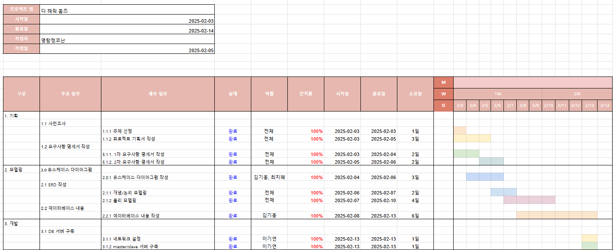  
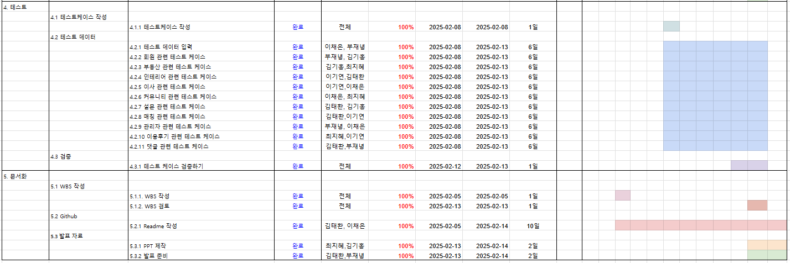

## Usecase

유스케이스

 
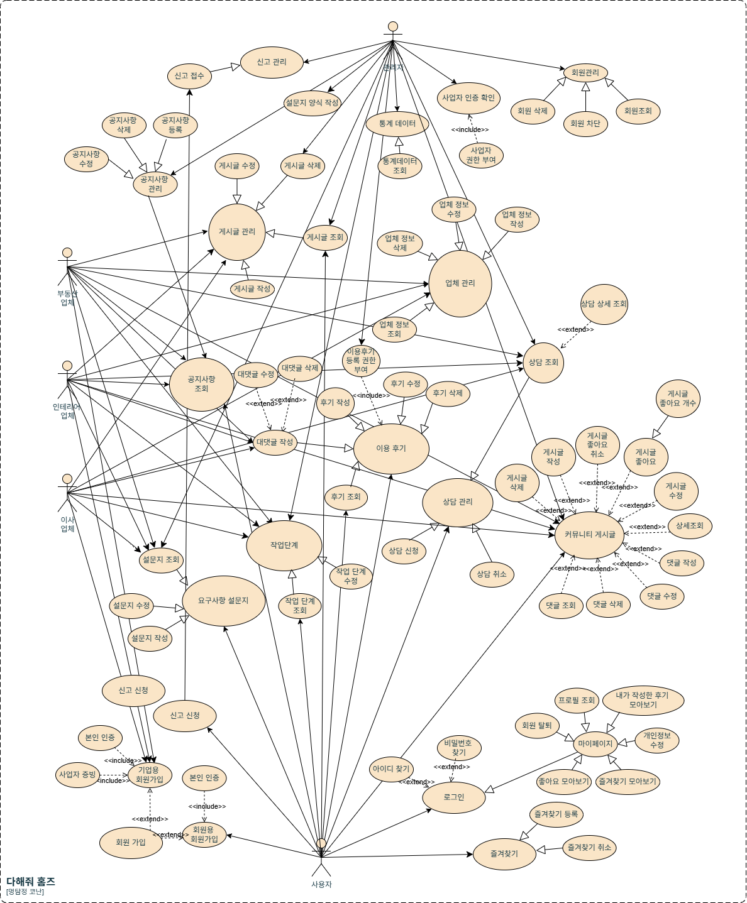

## Software-Requirement-Specification

요구사항 명세서

 

## Table-Definition-Document

 
 테이블 정의서 

 

## Modeling

Logical Data Modeling

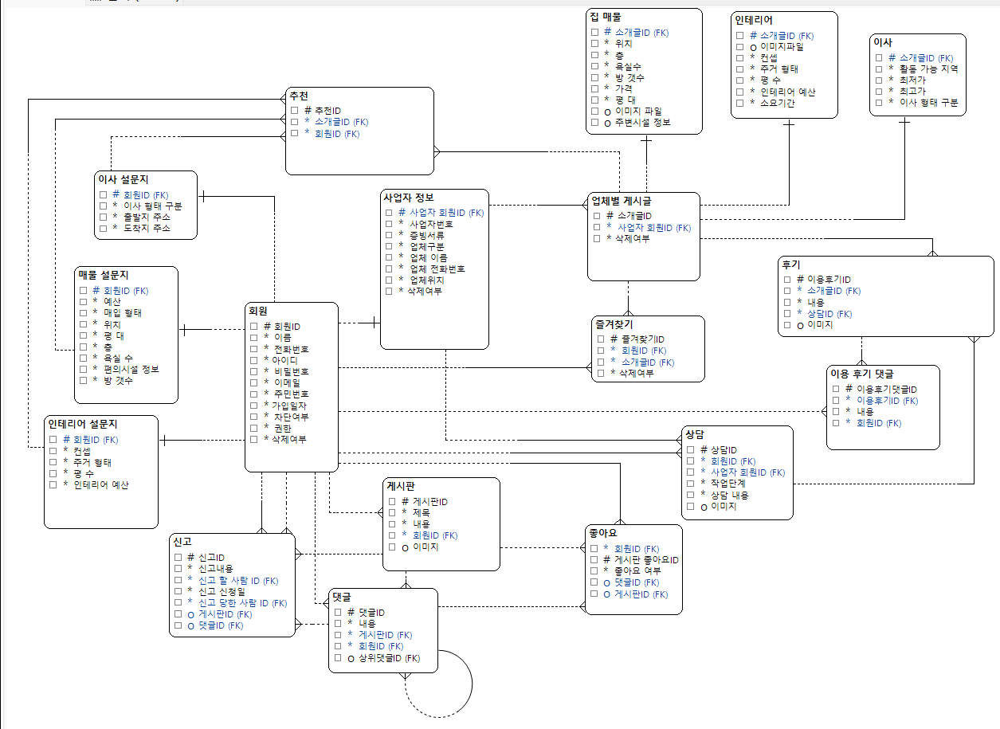

Physical Data Modeling

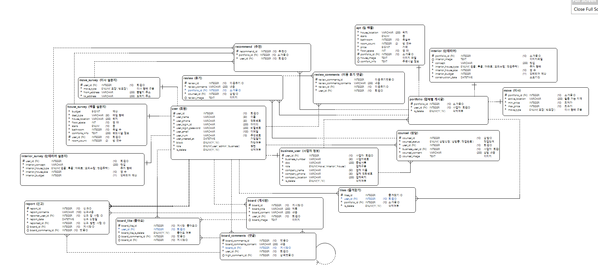

## Server-Setup
### Replication 서버 구축
   **1. 개요**  
* Master-Slave 서버를 구축하고, 데이터 베이스 복제를 설정하는 과정을 기록  
* 이는 데이터 무결성 유지 및 부하 분산을 위해 구현 
 

  **2. 목적**
* 데이터 무결성 및 고가용성 유지
* 부하 분산
* 백업 및 복구 용이  

 

**3. Master 및 Slave 서버 연동**  
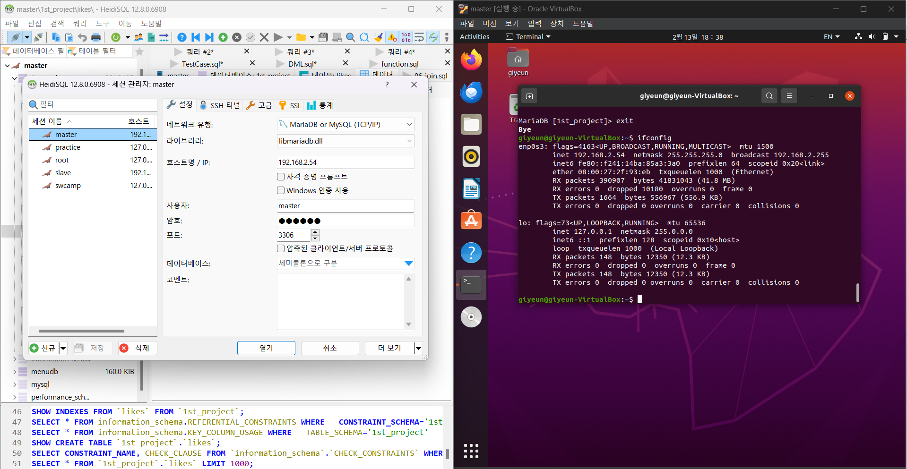

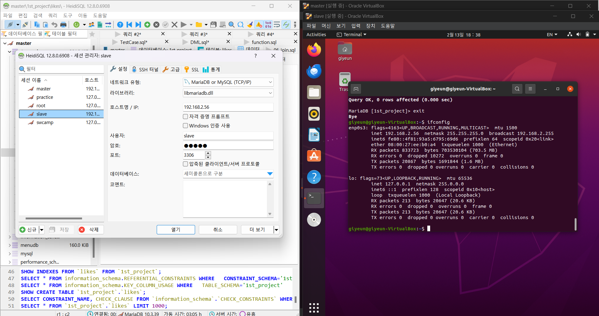
 
 
**4. Master 서버에 데이터베이스 생성 후 Slave 서버에 동기화**
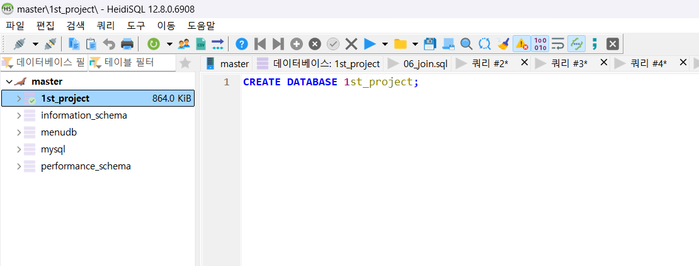

 

**5. slave 서버에서 데이터 변경 시 read only옵션으로 인한 오류 발생**

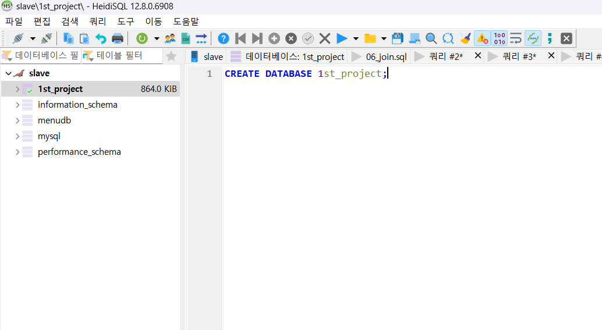
## TestCase-and-Query

💌테스트 케이스

 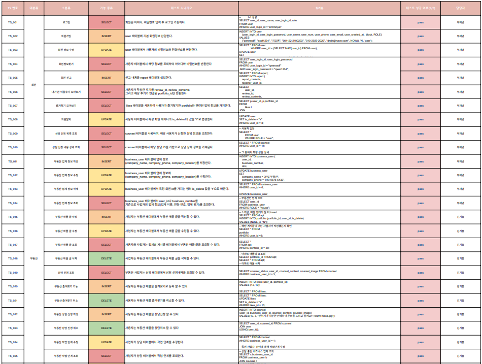
 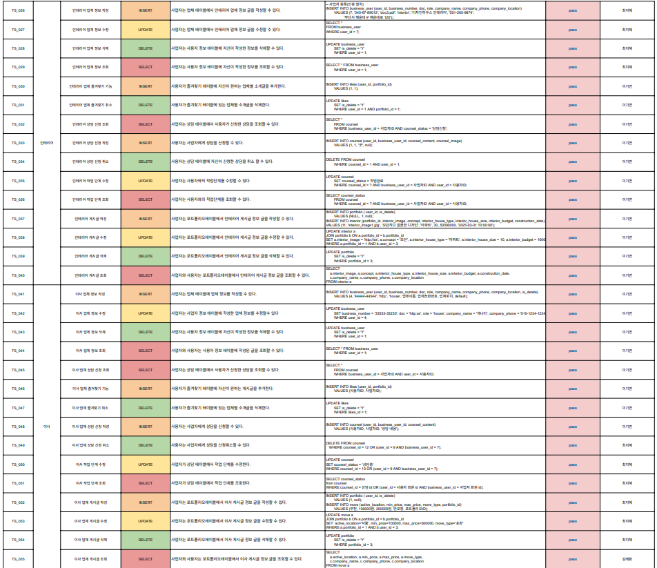
 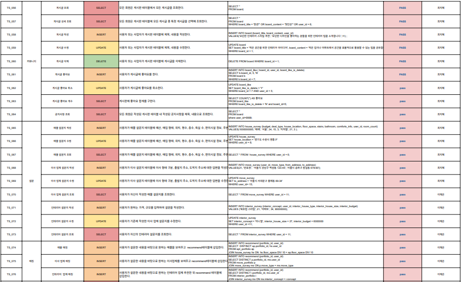
 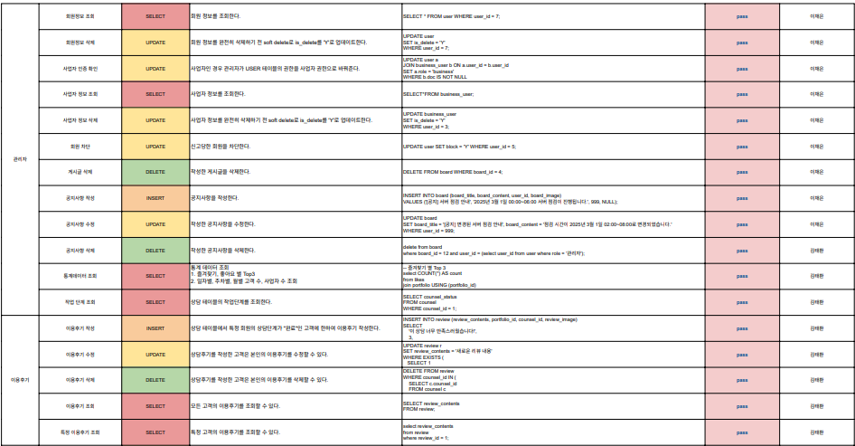
 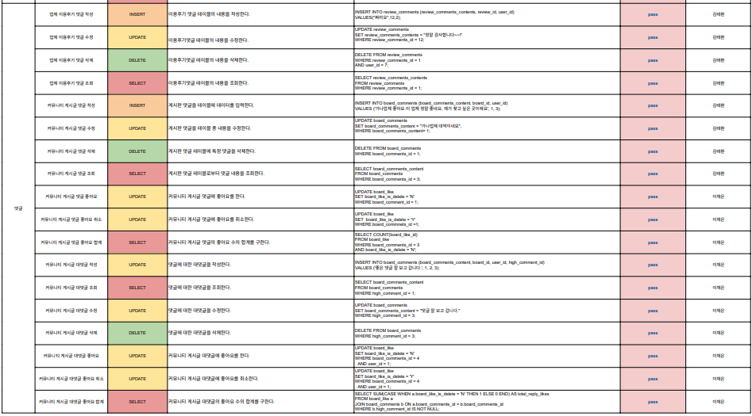
 

 👩회원

¹로그인

²회원가입

 

³회원 정보 수정

⁴회원정보찾기

 

⁵회원신고

 

⁶내가 쓴 이용후기 모아보기

 

⁷즐겨찾기 모아보기

 

⁸회원탈퇴

 

⁹상담 신청 목록 조회

¹⁰상담 신청 내용 상세 조회

 

 🏠부동산

¹부동산 업체 정보 작성

 

²부동산 업체 정보 수정

 

³부동산 업체 정보 삭제

 

⁴부동산 업체 정보 조회

 

⁵부동산 매물 글 작성

 

⁶부동산 매물 글 수정

 
 

⁷부동산 매물 글 조회

 

⁸부동산 매물 글 삭제

 
 

⁹부동산 상담 신청 조회

 

¹⁰부동산 상담 신청 작성

 

¹¹부동산 상담 신청 취소

 

¹²부동산 즐겨찾기 기능

 

¹³부동산 즐겨찾기 취소

 
 

¹⁴부동산 작업 단계 수정

 
 

¹⁵부동산 작업 단계 조회

 

 🛋️인테리어

¹인테리어 업체 정보 작성

 

²인테리어 업체 정보 수정

 

³인테리어 업체 정보 삭제

 

⁴인테리어 업체 정보 조회

 

⁵인테리어 상담 신청 조회

 

⁶인테리어 상담 신청 작성

 

⁷인테리어 상담 신청 취소

⁸인테리어 업체 즐겨찾기 기능

 

⁹인테리어 업체 즐겨찾기 취소

 

¹⁰인테리어 작업 단계 수정

 

¹¹인테리어 작업 단계 조회

 

¹²인테리어 게시글 작성

 

¹³인테리어 게시글 수정

 

¹⁴인테리어 게시글 삭제

 

¹⁵인테리어 게시글 조회

 

 📦이사

¹이사 업체 정보 작성

 

²이사 업체 정보 수정

 

³이사 업체 정보 삭제

 

⁴이사 업체 정보 조회

 

⁵이사 업체 상담 신청 조회

 

⁶이사 업체 상담 신청 작성

 

⁷이사 업체 상담 신청 취소

 

⁸이사 업체 즐겨찾기 기능

 

⁹이사 업체 즐겨찾기 취소

 

¹⁰이사 작업 단계 수정

 

¹¹이사 작업 단계 조회

 

¹²이사 업체 게시글 작성

 

¹³이사 업체 게시글 수정

 

¹⁴이사 업체 게시글 삭제

 

¹⁵이사 업체 게시글 조회

 

 💬커뮤니티

¹게시글 조회

 

²게시글 상세 조회

 

³게시글 작성

 

⁴게시글 수정

 

⁵게시글 삭제

 

⁶게시글 좋아요

 

⁷게시글 좋아요 취소

 

⁸게시글 좋아요 개수

 

⁹공지사항 조회

 

 📝설문

¹매물 설문지 작성

 

²매물 설문지 수정

 

³매물 설문지 조회

 

⁴이사 업체 설문지 작성

 

⁵이사 업체 설문지 수정

⁶이사 업체 설문지 조회

 

⁷인테리어 설문지 작성

 

⁸인테리어 설문지 수정

 

⁹인테리어 설문지 조회

 

 😍매칭

¹매물 매칭

 

²이사 업체 매칭

 

³인테리어 업체 매칭

 👨‍💼관리자

¹회원 정보 조회

 

²회원 정보 삭제

 

³사업자 인증 확인

 

⁴사업자 정보 조회

 

⁵사업자 정보 삭제

 

⁶회원 차단

 

⁷게시글 삭제

 

⁸공지사항 작성

 

⁹공지사항 수정

 

¹⁰공지사항 삭제

 

¹¹통계데이터 조회

¹²작업 단계 조회

 

 ⌨️이용 후기

¹이용 후기 작성

 

²이용 후기 수정

 

³이용 후기 삭제

 
 

⁴이용 후기 조회

 

⁵특정 이용 후기 조회

 

 🖥️댓글

¹업체 이용후기 댓글 작성

 

²업체 이용후기 댓글 수정

 
 

³업체 이용후기 댓글 삭제

 

⁴업체 이용후기 댓글 조회

 

⁵커뮤니티 게시글 댓글 작성

 

⁶커뮤니티 게시글 댓글 수정

 

⁷커뮤니티 게시글 댓글 삭제

 

⁸커뮤니티 게시글 댓글 조회

 

⁹커뮤니티 게시글 댓글 좋아요

 

¹⁰커뮤니티 게시글 댓글 좋아요 취소

 

¹¹커뮤니티 게시글 댓글 좋아요 합계

 

¹²커뮤니티 게시글 대댓글 작성

 

¹³커뮤니티 게시글 대댓글 조회

 

¹⁴커뮤니티 게시글 대댓글 수정

 

¹⁵커뮤니티 게시글 대댓글 삭제

 

¹⁶커뮤니티 게시글 대댓글 좋아요

 

¹⁷커뮤니티 게시글 대댓글 좋아요 취소

 

¹⁸커뮤니티 게시글 대댓글 합계

 

 🛖관련 Storaged Object

후기 작성 시 상담 상태 확인 트리거

 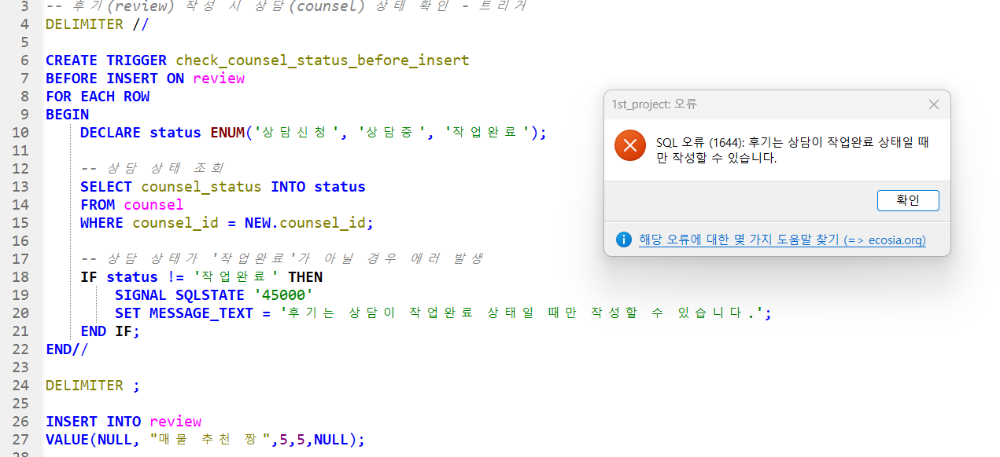

회원 탈퇴시 관련 데이터 정리 트리거

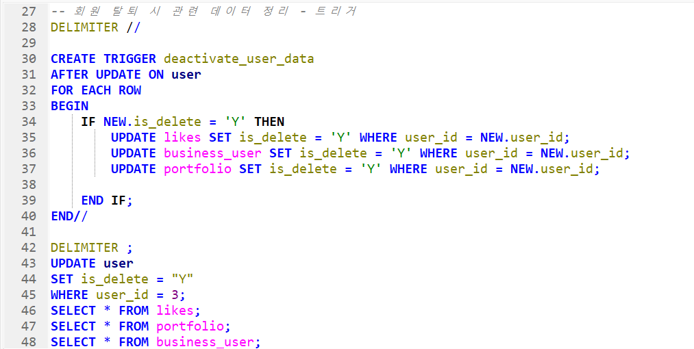
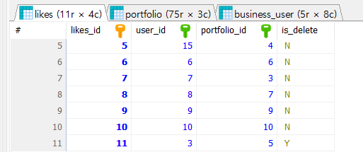
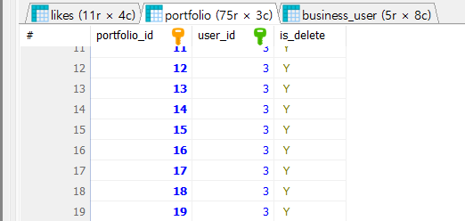
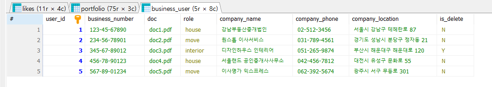

신고횟수 초과 시 자동 상담 요청을 생성하는 트리거

 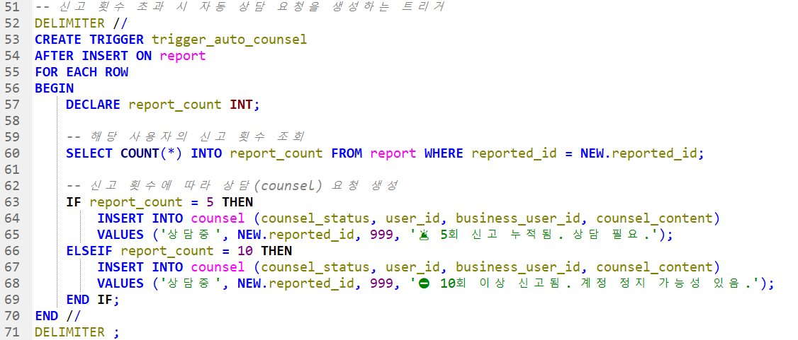
 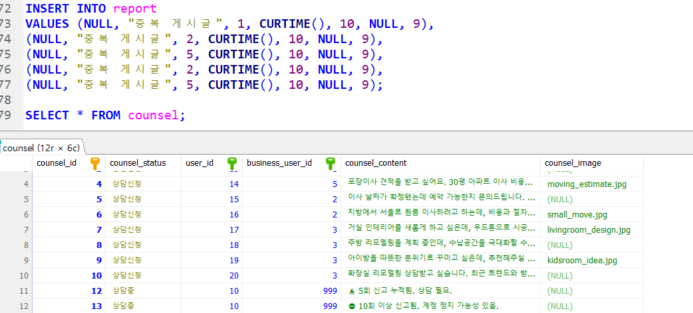

특정 사용자가 작성한 모든 후기 가져오기 프로시져

 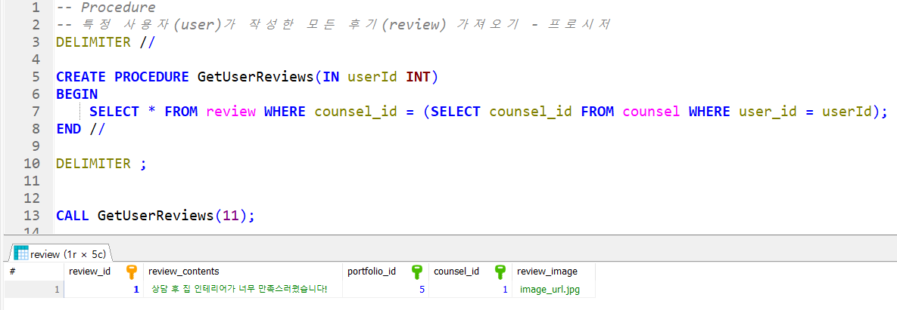

특정 상담 상태 변경 프로시져

    
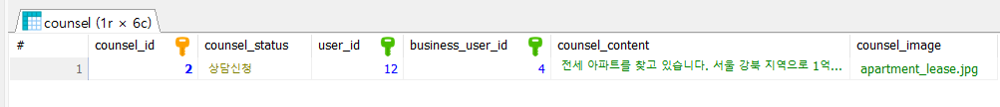
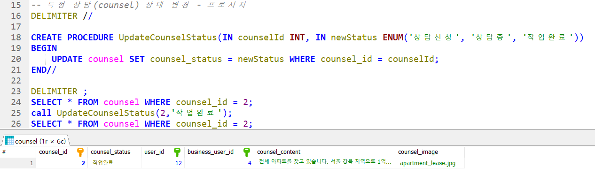

Top3 즐겨찾기 조회 프로시저

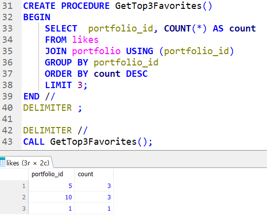

Top3 게시판 좋아요 조회 프로시저

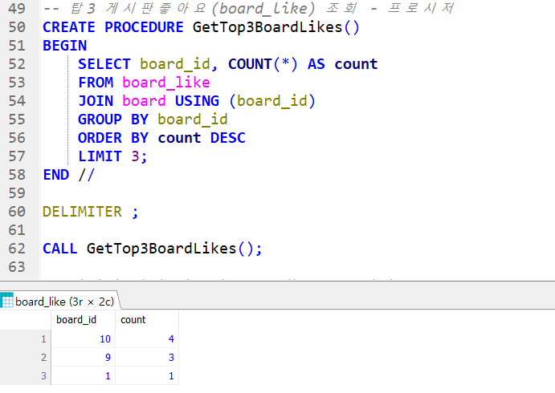

일자별 가입 사용자 수 조회 프로시저

 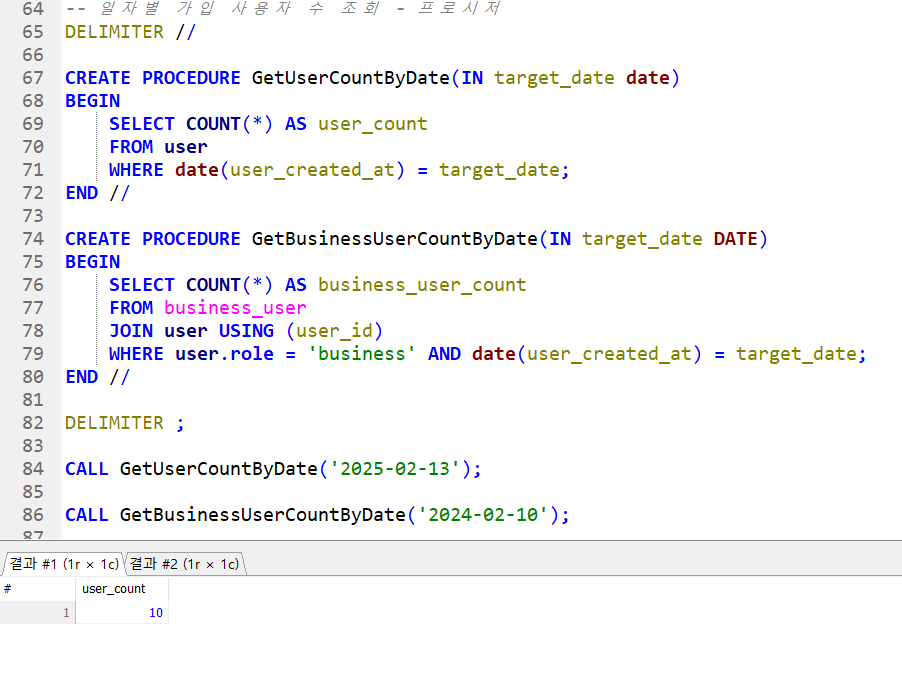

일자별 가입 사업자 수 조회 프로시저

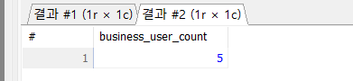

월자별 가입 사용자 수 조회

 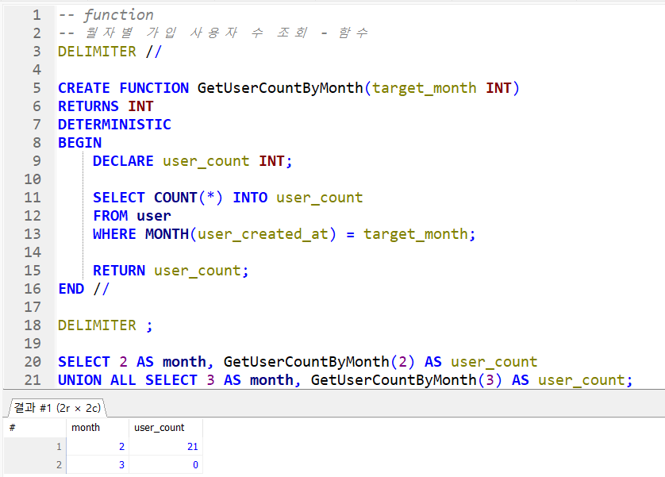

월자별 가입 비즈니스 사용자 수 조회

 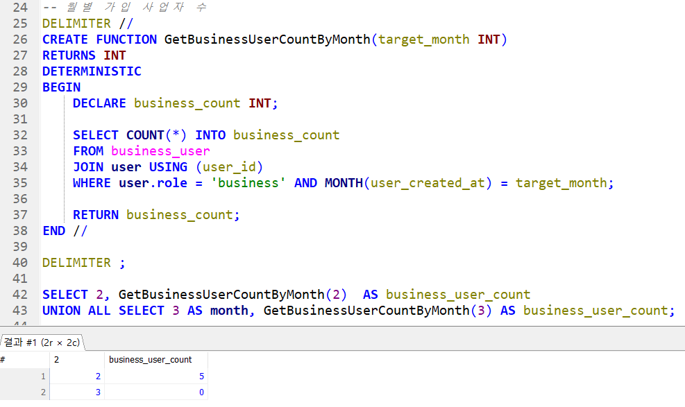

## Tech-Stacks

| Category   | Tools/Technologies |
|------------|--------------------|
| Database   |              |
| OS    |     |
| collaboration tool |             |
| Modeling |       |

## Feedback 
| 조원명 | REIVIEW |
| --- | --- |
| 김기홍 |내용 삽입|
| 김태환 |내용 삽입|
| 부재녕 |프로젝트를 진행하면서 수업 시간에 이해하지 못했던 것들을 다시 한 번 경험해 볼 수 있어서 너무 좋았던 것 같습니다. 첫 프로젝트여서 어떻게 해야 할지 막막하고 정말 너무 부족한 실력이었지만 많은 걸 가르쳐 주시고 인내심 있게 기다려 주신 팀원들에게 감사합니다. 좋은 팀원들을 만나 첫 프로젝트를 무사히 잘 끝낼 수 있었습니다. 팀원들 덕분에 한 단계 더 성장할 수 있었던 기회였습니다!!! |
| 이기연 |내용 삽입|
| 이채은 |내용 삽입|
| 최지혜 |내용 삽입|

