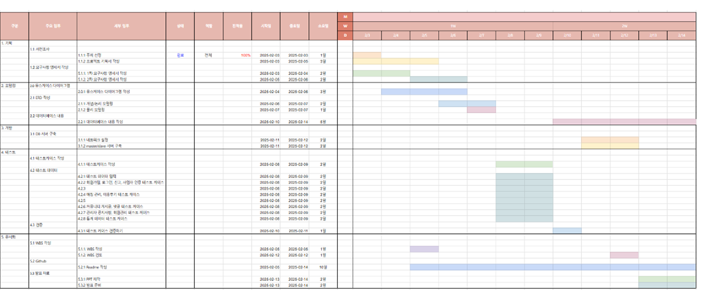

# be15-1st-DetectiveConan-DoItAllHolmes

---

## 목차
1. [프로젝트 기획서](#Project Proposal)
2. [프로젝트 세부 사항](#Project Detail)
3. [기술 스택](#Tech Stacks)
4. [WBS](#WBS)
5. [모델링](#Modeling)
6. [테스트케이스 및 쿼리](#TestCase and Query)
7. [동료평가](#Feedback)

---
## Project Proposal
### Do It All, Holmes!
> ## 목표
> ---
>> ⭐ 집 구하는 것부터 시작해서 이사, 인테리어, 매물 구하는 것까지 ONE-STOP으로 제공

### Project Overview
>> **1. 사용자는 한 번의 설문조사만으로 부동산 매물 확인, 인테리어, 이사 업체 연결까지 원스톱(ONE-STOP)으로 제공받아, 여러 업체에 일일이 정보를 문의하는 번거로움을 줄일 수 있습니다.**

>> **2. 또한 정보의 비대칭성을 해소하기 위해 사용자들의 투명한 후기를 제공하여 보다 신뢰할 수 있는 결정을 내릴 수 있도록 돕습니다.** 

>> **3. 이 플랫폼은 사용자의 요구사항을 반영한 맞춤형 서비스를 제공하며, 바쁜 현대인들에게 편리함과 안정감을 선사하는 유용한 솔루션입니다.**
### Problem Definition
> 
> >> **🗨 매물 찾기부터 이사까지 최소 2주~8주 , 인테리어 1~2달, 업체 조사부터 연락, 날짜 선정 등 다 따로 따로 오랜 시간에 걸쳐 정해야 한다.**
> 
> >> **🗨 빠르게 변화하는 리모델링 트렌드, 맞춤형 인테리어 수요 증가, 소셜 미디어의 영향에 따라 계속해서 증가하고 있다.**
> 
> >> **🗨 4,50대의 경우 전원생활 희망하며, 단독주택 인테리어까지 희망 하는데 핸드폰을 오래보는 것이 힘들다.**
> 
> >> **🗨 여러 이사 업체와 인테리어 회사가 있어 한 번에 쉽게 업체 간의 특징을 비교 가능한 어플이 없어 이사와 인테리어에 불만족하는 사용자 증가하고 있다.**
> 
> >> **🗨 집, 이사, 인테리어에 대한 정보를 찾기 위해 여러 업체와 서비스에 가입 해야 하는 번거로움이 있다.**

[**관련 기사_1**](http://www.yongdal.pro/board/notice_view.html?n=45)  
[**관련 기사_2**](https://www.jutek.kr/user/selectBbsColumn.do?BBS_NUM=1374&COD03_CODE=c0318&MEN02_NUM=57&pageNum=1)  
[**관련 기사_3**](https://blog.opensurvey.co.kr/article/living-2020-2/)

### Project Necessity
> >> **💡한 번의 회원 가입으로 부동산 매물 검색부터 시작해, 맞춤형 인테리어 디자인과 이사 업체까지,  후기를 통해 신뢰할 수 있는 업체들과 사용자 한 명 한 명의 요구에 맞춰 최적의 선택을 가능하게 해준다.**
> 
> >> **💡이사 업체와 인테리어 업체에 대한 다른 사용자의 투명한 후기들로 인해 사용자들이 업체에 대해 불만족을 최대한 줄일 수 있다.**
> 
> >> **💡핸드폰을 오래 보는 것이 힘든 4,50대에게 빠르게 원하는 조건에 맞는 정보를 찾아준다.**
> 
> >> **💡집에 대한 고민이 있는 사람들에게 커뮤니티를 제공하여 정보를 공유할 수 있게 해준다.**

## Project Detail

### Target Customer
>
>- **나의 여건에 맞게 집을 구하고 싶고,**  
>- **내가 생각하는 조건에 맞는 인테리어를 할 수 있는 업체를 빠르게 찾고 싶고**
>- **믿을 수 있는 업체를 소개 받고 싶다!**
## **➡ 위의 과정을 ONE-STEP으로 소개 받고 싶은 사람**

### Main Function
> - **부동산 매물 검색**
> >> **💡지역, 가격, 면적 등 사용자의 조건에 맞는 다양한 매물을 검색하고 비교할 수 있습니다.**
> - **인테리어 디자인 서비스**
> >> **💡사용자는 각 인테리어 업체가 제공하는 다양한 디자인 포트폴리오를 확인하여, 자신이 원하는 스타일과 분위기를 갖춘 디자인을 쉽게 선택할 수 있습니다.**
> - **이사 업체 연결**
> >> **💡사용자는 포장이사와 반포장이사 등 다양한 이사 서비스 종류를 선택하여 자신에게 가장 적합한 옵션을 결정하고, 이사 일정을 예약할 수 있습니다.**
> - **커뮤니티**
> >> **💡커뮤니티를 통해 누구나 자신의 방의 인테리어나 가구를 소개하는 글을 작성해 서로 소통할 수 있습니다.**

### Product
> #### usecase
>> 

> #### Software Requirement Specification
>> 
>> 
>> 

## Tech Stacks
| Category | Tools/Technologies |  
|----------|-------------------|
| Database ||
| VCS      | |
| Modeling ||

## WBS
>> 

## Modeling
> ### Logical Modeling
>>
> ### Physical Modeling

## 10. 테스트 결과서(테스트 쿼리문 포함)

테스트 케이스 정의서

### 사용자

사용자

회원관리

회원가입(아이디 중복 확인)

###

회원정보조회_아이디

###

회원정보조회_성별

###

관리자 등록 변경

###

회원 정보 변경

###

회원 탈퇴

###

회원 공개 정보 변경

로그인

아이디 정보 조회(디비에 있는 경우)

###

아이디 정보 조회(디비에 없는 경우)

###

비밀번호 교체 주기 확인

### 취향

취향

사용자 취향 호출

###

사용자 취향 저장

###

사용자 취향 삭제

###

사용자 취향 수정

###

게시글 취향 호출

###

게시글 취향 저장

###

게시글 취향 삭제

###

게시글 취향 수정

###

여행 코스 취향 호출

###

여행 코스 취향 저장

###

여행 코스 취향 삭제

###

여행 코스 취향 수정

### 게시판

게시판

게시글 등록

###

게시글 임시 저장

###

게시글 수정

###

게시글 삭제

###

게시글 조회-작성일자 기준

.png)

###

게시글 조회-조회수 정렬

.png)

###

게시글 상세조회

###

별점 등록

###

별점 수정

###

별점 삭제

###

댓글 등록

###

댓글 수정

###

댓글 삭제

###

댓글 조회

###

댓글 좋아요 등록

###

댓글 좋아요 삭제

###

게시글 작성자 프로필 조회

###

댓글 작성자 프로필 조회

### 여행 코스

여행 코스

나라 등록

###

나라 수정

###

나라 삭제

###

도시 등록

###

도시 수정

###

도시 삭제

###

코스 등록

###

코스 수정

###

코스 삭제

###

코스 전체 조회 & 검색

###

코스 상세 조회

###

여행 동행 모집 등록

###

여행 동행 모집 수정

###

여행 동행 모집 삭제

###

여행 동행 모집 상태 설정

###

여행 동행 모집 전체 조회 & 검색

###

여행 동행 모집 상세 조회

###

여행 동행 모집 참가 신청

###

여행 동행 모집 참가 신청 관리

###

여행 동행 모집 강퇴

###

여행 동행 모집 나가기

### 신고

신고

여행 후기 신고

###

여행 후기 신고 승인

###

여행 후기 신고 반려

###

여행 후기 댓글 신고 

###

여행 후기 댓글 신고 승인 

###

여행 후기 댓글 신고 

###

여행 코스 신고 

###

여행 코스 신고 승인 

###

여행 코스 신고 반려 

###

여행 동행 신고 

###

여행 동행 신고 승인 

###

여행 동행 신고 반려 

###

신고 내역 조회 

###

신고 내역 상세 조회-후기

###

신고 내역 상세 조회-댓글

###

신고 내역 상세 조회-코스

###

신고 내역 상세 조회-동행

###

정지 이력 기록

### 알림

알림

알림 템플릿 등록

###

알림 템플릿 수정

###

알림 템플릿 삭제

###

알림 템플릿 조회

###

알림 템플릿 상세조회

###

댓글 작성 알림 발송

 

###

별점 알림 발송

 

###

동행참가 알림 발송

 

###

신고 승인 시 알림발송

 

###

동행 참가여부에 따른 알림발송

 

 
